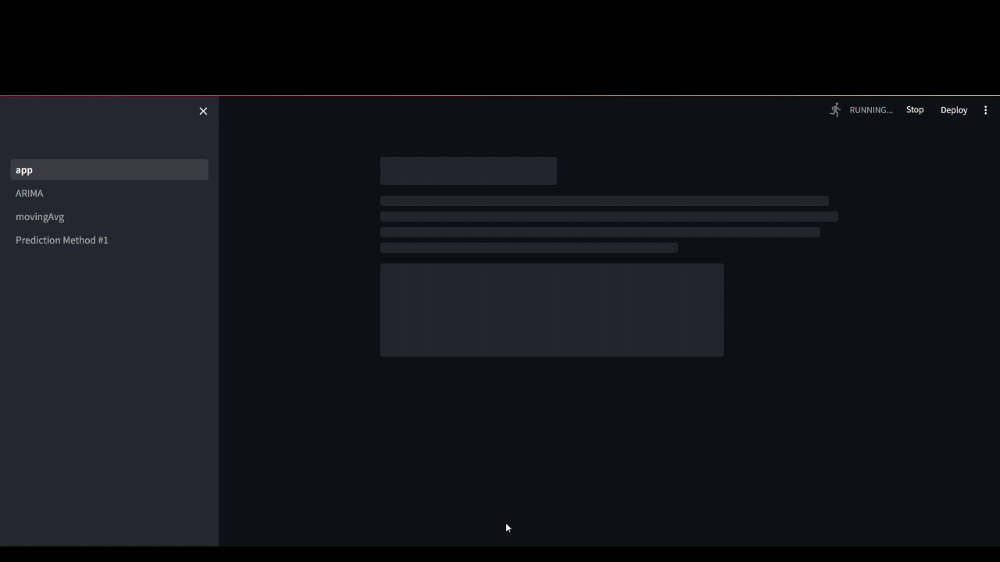

# 🧠 Cortex TA AI StockBot V4

**Cortex TA AI StockBot V4** is an enterprise-grade, intelligence-driven automated trading companion and algorithmic analysis platform. Version 4 fuses traditional programmatic **Technical Analysis (TA)** mathematical frameworks with state-of-the-art **Artificial Intelligence Reasoning** architectures. It processes high-frequency market pipelines, evaluates complex indicator correlations, and utilizes localized or cloud-based AI nodes to make systematic, emotion-free trading recommendations and portfolio insights.

---

## 📺 Visual Demonstrations

### 🖥️ Graphical User Interface (GUI) Showcase

*Explore the interactive dashboard, real-time tracking metrics, and dynamic algorithmic signal panels.*

```markdown
<p align="center">
  
</p>

```

### ⚙️ Codebase & Core Execution Pipeline

*Observe the underlying multi-threaded data ingestion pipeline, technical indicator vectors, and AI context engineering cycles.*

```markdown
<p align="center">
  
</p>

```

---

## 🚀 Key Features

* **📈 Advanced Technical Analysis Layer:** Real-time generation of multi-tiered indicators including RSI, MACD, Bollinger Bands, Exponential Moving Averages (EMA), Stochastic Oscillators, and custom structural breakout markers.
* **🤖 Cognitive AI Core Engine:** Synthesizes structured data vectors into human-interpretable market contexts using contextual agent reasoning models, running seamlessly via local infrastructure (Ollama/Qwen/Llama) or standard API endpoints.
* **📊 Immersive Graphical Interface:** High-fidelity, real-time updating visualization canvas designed to monitor data processing, strategy backtesting tracks, and instantaneous signal execution outputs.
* **🛡️ Automated Risk Mitigation Architecture:** Built-in calculation modules implementing strict math models ($Stress = Modulus \times Strain$ equivalent constraints applied to portfolio volatility) to govern trailing stops, dynamic asset allocation, and maximum drawdowns.
* **⚡ Async Multi-Threaded Engine:** Decoupled data ingestion pipelines ensure zero-latency isolation between the incoming websocket/API streams, GUI event loops, and LLM orchestration layers.

---

## 🛠️ System Architecture

```
                       ┌─────────────────────────┐
                       │   Market Data Stream    │
                       │ (APIs / WebSockets Live)│
                       └────────────┬────────────┘
                                    │ (Raw Tickers)
                                    ▼
                       ┌─────────────────────────┐
                       │  Technical Analysis Layer│
                       │ (RSI, MACD, EMAs, Vol)  │
                       └────────────┬────────────┘
                                    │ (Feature Vectors)
                                    ▼
┌─────────────────────────┐    ┌─────────────────────────┐
│     AI Model Context    │◄───┤ Dynamic Context Vector  │
│  (Local/Cloud Reasoning)│    │   Engineering Engine    │
└────────────┬────────────┘    └─────────────────────────┘
             │                                
             │ (Inference Decisions)          
             ▼                                
┌─────────────────────────┐    ┌─────────────────────────┐
│   Risk Management Layer ├───►│   Interactive GUI/Bot   │
│  (Stop/Loss Validation) │    │  Dashboard Execution    │
└─────────────────────────┘    └─────────────────────────┘

```

---

## 📦 Tech Stack & Modules

* **Core Logic Engine:** Python 3.10+
* **Data Aggregation & TA:** `pandas`, `numpy`, `TA-Lib` / Custom Signal Vectorizers
* **AI Infrastructure:** Local LLM Pipeline integrations (compatible with `Ollama`, `HuggingFace Transformers`, `OpenAI API`)
* **GUI Interface Ecosystem:** Integrated visual framework featuring reactive styling elements and responsive chart canvases.

---

## 📥 Installation & Environment Setup

### 1. Clone the Repository

```bash
git clone https://github.com/HashemNeo/Cortex_TA_AI_StockBotV_4.git
cd Cortex_TA_AI_StockBotV_4

```

### 2. Configure Your Virtual Environment

```bash
# Create Virtual Environment
python -m venv venv

# Activate Virtual Environment (Linux/macOS)
source venv/bin/activate

# Activate Virtual Environment (Windows)
venv\Scripts\activate

```

### 3. Install Dependencies

```bash
pip install --upgrade pip
pip install -r requirements.txt

```

---

## ⚙️ Configuration Setup

Create a system environment configuration file named `.env` in the root directory of the workspace:

```env
# --- Market API Providers ---
MARKET_DATA_PROVIDER="yfinance" # alpha_vantage, binance, etc.
API_KEY_SECRET="your_market_api_key_here"

# --- AI Engine Node Profiles ---
AI_INFERENCE_MODE="local" # Options: local | cloud
LOCAL_LLM_ENDPOINT="http://localhost:11434"
TARGET_MODEL_TAG="qwen2.5-coder" # Or llama3.1 / custom model variant

# --- Portfolio Architecture Guidelines ---
BASE_TRADING_CURRENCY="USD"
INITIAL_RISK_CAPITAL=50000
MAX_DRAWDOWN_LIMIT_PCT=2.5

```

---

## 🏃 Running the Application

To launch the core engine alongside the interactive visual UI layer, execute the main entrypoint:

```bash
python main.py

```

### running tests (Optional)

To validate structural health checks and financial algorithm components:

```bash
pytest tests/

```

---

## 🤝 Contribution & Development Lifecycle

1. Fork the Project Repository.
2. Create your Feature Branch (`git checkout -b feature/AmazingFeature`).
3. Commit your changes programmatically (`git commit -m 'feat: introduce optimized signal processing block'`).
4. Push the upstream sequence (`git push origin feature/AmazingFeature`).
5. Open a professional **Pull Request**.

---

## 📄 License

Distributed under the MIT License. See the attached `LICENSE` configuration file for comprehensive system parameters and authorization disclosures.

---

### 💡 Tips for importing your GIFs:

1. Save your two GIFs inside a directory named `assets` in your repository (`assets/gui_demo.gif` and `assets/codebase_demo.gif`).
2. Once pushed, the markdown code blocks above will automatically compile and stream your animations directly into your GitHub landing page profile.
